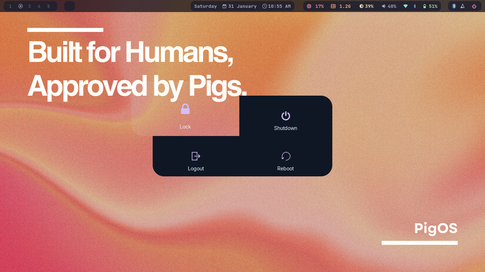
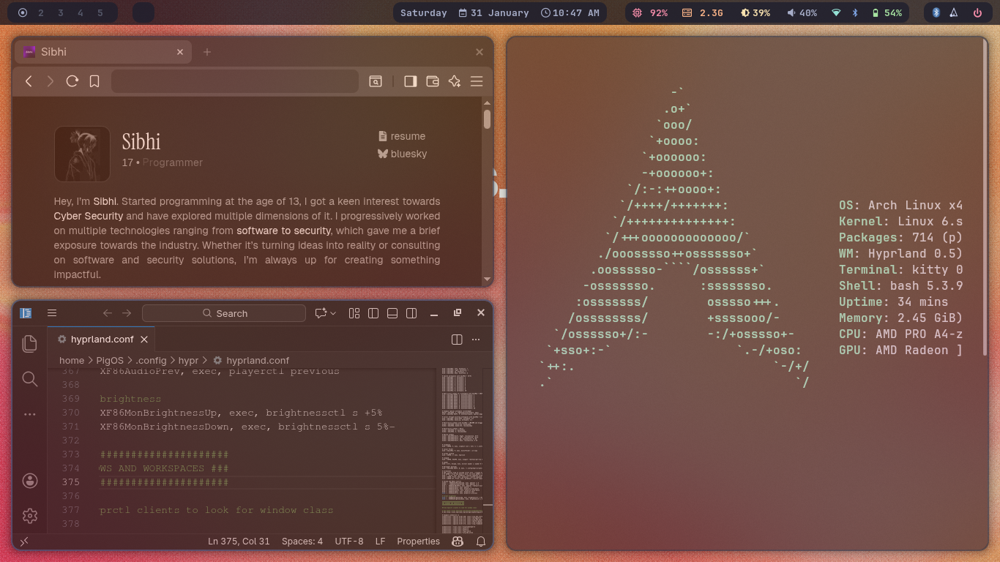

# 🐷 PigOS — Hyprland Desktop Environment

PigOS is a pre-configured, opinionated Hyprland desktop environment built on **Arch Linux**.  
It focuses on speed, aesthetics, and a zero-friction daily workflow.

This repository provides automated scripts to install and configure everything you need for a polished Wayland setup using Hyprland. No hunting configs. No half-working rice. Just boot in and go.

---

## 📚 Table of Contents

- [Overview](#overview)
- [Showcase](#showcase)
- [Features](#features)
- [Prerequisites](#prerequisites)
- [Installation](#installation)
- [Configuration Files](#configuration-files)
- [Post-Installation](#post-installation)
- [Troubleshooting](#troubleshooting)
- [Logs](#logs)
- [Contributing](#contributing)
- [License](#license)
- [Links](#links)
- [Acknowledgments](#acknowledgments)

---

## 🧠 Overview

PigOS automates the setup of a complete Hyprland-based desktop, including:

- A custom Hyprland configuration tuned for daily use  
- A clean status bar, launcher, notifications, and lock screen  
- Working audio, networking, Bluetooth, and display manager  
- Pre-themed terminal, launcher, and UI components  
- Sensible defaults with room to customize  

If you want a modern Wayland desktop without spending days tweaking configs, PigOS is for you.

---

## 🖼️ Showcase

This is what PigOS looks like out of the box:

<table>
  <tr>
    <td></td>
    <td></td>
  </tr>
  <tr>
    <td></td>
    <td></td>
  </tr>
</table>

---

## 🎁 Features

### Core Desktop
- **Hyprland** — Wayland compositor and window manager  
- **Waybar** — Status bar with custom modules  
- **Tofi** — Fast app launcher  
- **Kitty** — GPU-accelerated terminal  
- **Dunst** — Notifications  

### Utilities
- **Hyprlock** — Screen locker  
- **Hypridle** — Idle management  
- **Wlogout** — Logout and power menu  
- **SWWW** — Wallpaper daemon  
- **Grimblast** — Screenshots  
- **Hyprpicker** — Color picker  
- **Cliphist** — Clipboard history  

### System Services
- **PipeWire** — Audio  
- **NetworkManager** — Networking  
- **Bluetooth** — With GUI tools  
- **SDDM** — Display manager  

Everything is wired together so it works immediately after login.

---

## 🔧 Prerequisites

Before installing PigOS, make sure you have:

1. Arch Linux (or an Arch-based system)  
2. Sudo access  
3. A working internet connection  
4. Git installed  

> This setup is designed for Arch. Other distros are not supported.

---

## 🚀 Installation

### Step 1: Clone the Repository

```bash
git clone https://github.com/xibhi/PigOS.git
cd PigOS
```

### Step 2: Make the Script Executable

```bash
chmod +x install.sh
```

### Step 3: Run the Installation Script

**Important:** The script must be run as root:

```bash
sudo ./install.sh -y
```

### Step 4: Follow the Interactive Prompts

The installation script is interactive and will ask for confirmation before each major step:
- **Prerequisites Setup** - System packages, fonts, and essential tools
- **Hyprland & Critical Software Setup** - Window manager and core components
- **Basic Utilities & Configs Setup** - Status bar, launcher, and utilities
- **Final Setup** - Completion message and repository information

You can choose to:
- Accept (y) - Proceed with the installation
- Skip (n) - Skip the current step
- Retry - If a step fails, you'll be prompted to retry

## 📁 Configuration Files

All configuration files are copied to your home directory's `.config` folder:

```
~/.config/
├── hypr/
│   ├── hyprland.conf    # Main Hyprland configuration
│   ├── hyprlock.conf    # Screen locker configuration
│   └── hypridle.conf    # Idle management configuration
├── waybar/
│   ├── config.jsonc     # Waybar configuration
│   └── style.css        # Waybar styling
├── tofi/
│   ├── configA          # Tofi application launcher config
│   └── configV          # Tofi clipboard
├── dunst/
│   └── dunstrc          # Notification daemon config
├── kitty/
│   ├── kitty.conf       # Terminal configuration
│   └── theme.conf       # Terminal theme
├── wlogout/
│   ├── layout           # Session manager layout
│   ├── style.css        # Session manager styling
│   ├── logoutlaunch.sh # Launch script
│   └── icons/           # Session manager icons
└── assets/
    └── backgrounds/     # Sample wallpapers
```

## 🔄 Post-Installation

After installation completes:

1. **Reboot your system** to start using SDDM and Hyprland:
   ```bash
   sudo reboot
   ```

2. **Select Hyprland** from the SDDM display manager login screen

3. **Customize your setup** by editing configuration files in `~/.config/`

4. **Add your own wallpapers** to `~/.config/assets/backgrounds/`

5. **Configure keybindings** in `~/.config/hypr/hyprland.conf` to match your preferences

## 🐛 Troubleshooting

### Installation Issues

1. **Script fails with "Please run as root"**
   - Make sure you're running the script with `sudo ./install.sh`

2. **YAY installation fails**
   - Ensure you have `git` and `base-devel` installed
   - Check your internet connection
   - You may need to manually install YAY if the automated installation fails

3. **AUR package installation fails**
   - Some AUR packages may require manual intervention
   - Check the AUR page for the specific package for dependencies
   - You can manually install failed packages later using `yay -S <package-name>`

4. **OS detection warning**
   - The script is designed for Arch Linux
   - You can proceed anyway, but some packages may not be available on other distributions

### Runtime Issues

1. **Hyprland doesn't start**
   - Check logs: `journalctl -u hyprland` or `~/.config/hypr/hyprland.log`
   - Verify your graphics drivers are installed
   - Ensure you're using a Wayland-compatible setup

2. **Audio not working**
   - Check if Pipewire is running: `systemctl --user status pipewire`
   - Restart audio services: `systemctl --user restart pipewire`

3. **Network not working**
   - Check NetworkManager status: `systemctl status NetworkManager`
   - Use `nmcli` or `nmtui` to configure network connections

4. **Bluetooth not working**
   - Check bluetooth service: `systemctl status bluetooth`
   - Start bluetooth: `sudo systemctl start bluetooth`

5. **Configuration errors**
   - Check configuration syntax in `~/.config/hypr/hyprland.conf`
   - Validate JSON in Waybar config: `~/.config/waybar/config.jsonc`
   - Review logs in `~/logs/hyprland_install.log`

### Getting Help

- Check the [GitHub Issues](https://github.com/xibhi/PigOS/issues) section
- Open a new issue if you can't find a solution
- Review the [Hyprland Wiki](https://wiki.hyprland.org/) for configuration help

## 📝 Logs

Installation logs are saved to:
```
~/logs/hyprland_install.log
```

This log file contains:
- Timestamps for each operation
- Success/failure status
- User choices (accept/skip)
- Error messages

## 🫶🏻 Contributing

If PigOS helped you:

- Star the repo
- Report bugs
- Suggest improvements
- Open pull requests
- Improve documentation

Every contribution, big or small, is valuable to the community!

## 📄 License

This project is licensed under the MIT License.  
See the [LICENSE](LICENSE) file for full details.

You are free to use, modify, and distribute this software under the terms of the MIT License.

## 🔗 Links

- **GitHub Repository**: https://github.com/xibhi/PigOS
- **Hyprland Wiki**: https://wiki.hyprland.org/
- **Hyprland GitHub**: https://github.com/hyprwm/Hyprland

## ♥️ Acknowledgments

- Hyprland developers and community
- All the developers of the tools and utilities included in this setup
- The Arch Linux community

---

**Built for Humans, Approved by Pigs. 🐷**
