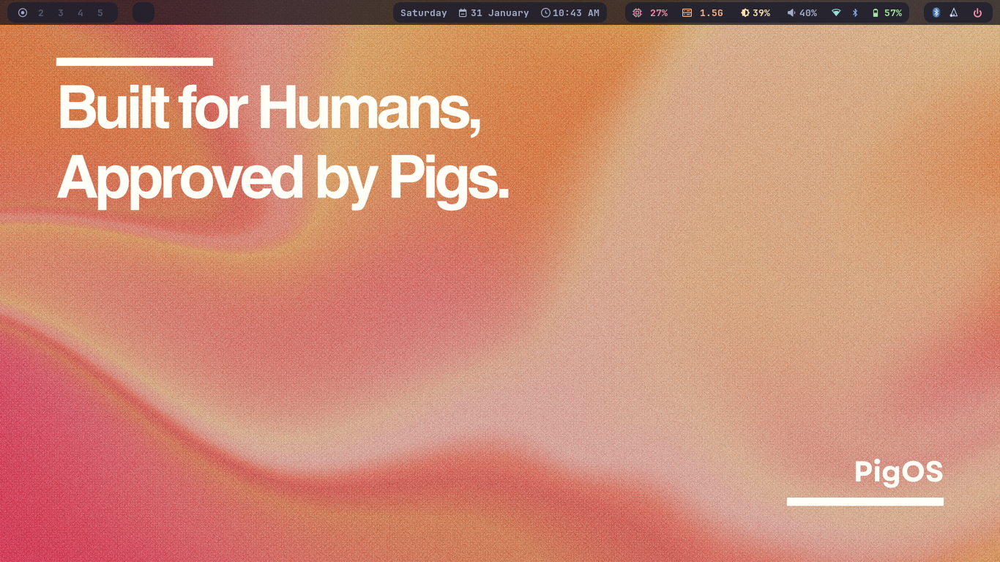
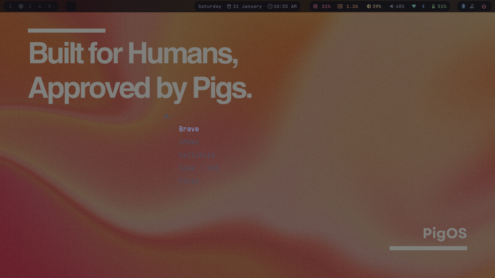
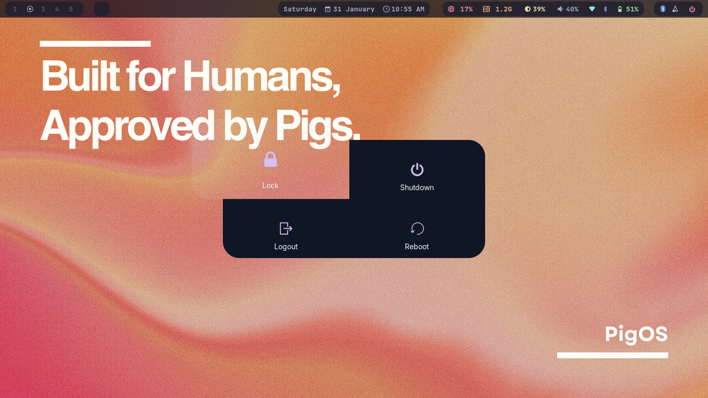
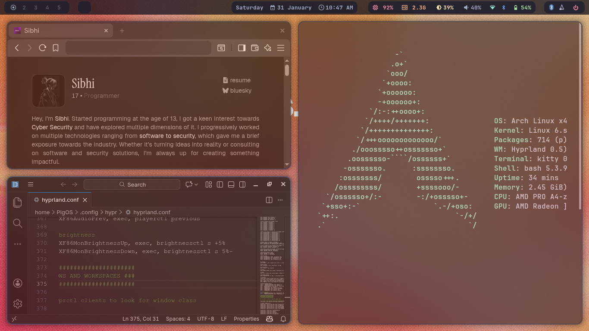

# PigOS

An opinionated Hyprland setup for Arch Linux. I built this to actually understand
the stack — compositor, bar, launcher, locker, idle daemon, all of it — instead
of just copying someone else's dotfiles and not knowing what half of it does.

---

# Screenshots

<table>
  <tr>
    <td></td>
    <td></td>
  </tr>
  <tr>
    <td></td>
    <td></td>
  </tr>
</table>

---

## Installation

```bash
git clone https://github.com/xibhi/PigOS.git
cd PigOS
chmod +x install.sh
sudo ./install.sh
```

Reboot. Select Hyprland from SDDM.

---

## Features

| Tool           | Role                                  |
|----------------|---------------------------------------|
| Hyprland       | Wayland compositor and window manager |
| Waybar         | Status bar with custom modules        |
| Tofi           | Fast app launcher                     |
| Kitty          | GPU-accelerated terminal              |
| Dunst          | Notifications                         |
| Hyprlock       | Screen locker                         |
| Hypridle       | Idle management                       |  
| Wlogout        | Logout and power menu                 |  
| SWWW           | Wallpaper daemon                      |
| Grimblast      | Screenshots                           |
| Hyprpicker     | Color picker                          |  
| Cliphist       | Clipboard history                     |  
| PipeWire       | Audio                                 |
| NetworkManager | Networking                            |  
| Bluetooth      | With GUI tools                        |
| SDDM           | Display manager                       | 

---

## Credits

- [Sibhi Balamurugan](https://github.com/xibhi)
- [Krish](https://github.com/Tokittoo)
- Hyprland community
- Arch community
